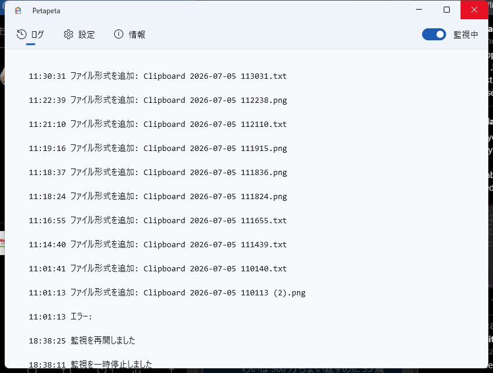
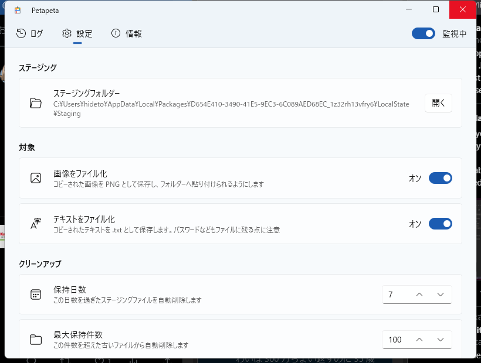

<div align="center">
  

  # Petapeta

  **コピーした画像やテキストを、デスクトップやフォルダーへそのまま「ペタッ」と貼り付けられるようにする常駐ツール**
</div>

---

## これは何？

私がかつて使っていた BeOS では、画像やテキストをクロップボードへコピーしてデスクトップに貼り付けると、勝手にファイルになってくれました（という記憶があります）。いろんなものをスクラップしてデスクトップに残しておきたいときに便利です。

でも、Windows では、画像やテキストをコピーしても、エクスプローラーやデスクトップで <kbd>Ctrl</kbd>+<kbd>V</kbd> しても**何も起きません**。クリップボードに「ファイルの一覧(`CF_HDROP`)」形式が入っていないからです。

**Petapeta** はクリップボードを常駐監視して、画像やテキストがコピーされた瞬間に、その内容をファイルとして書き出し、`CF_HDROP` 形式をクリップボードへ足します。すると――

> スクリーンショットを撮る → フォルダーで <kbd>Ctrl</kbd>+<kbd>V</kbd> → **PNG ファイルとして貼り付く**

というように、**OS 標準の貼り付け操作がそのままファイル保存になります**。専用のウィンドウもホットキーも要りません。元の画像・テキスト形式は保持するので、ペイントやメモ帳へ普通に貼り付けることもできます。

## 主な機能

- 🖼️ **画像 → PNG ファイル** / 📝 **テキスト → .txt ファイル**(それぞれオン/オフ可能)
- 🔔 貼り付け準備ができたら**通知音**(Windows 標準音から選択・テスト再生あり)
- 🗂️ 書き出したファイルの**自動クリーンアップ**(保持日数・最大件数をカスタマイズ)
- 🌗 **ライト / ダーク / システム**テーマ、**日本語 / English** 切り替え
- 🚀 **Windows 起動時に自動開始** / **最小化状態で起動**
- 📌 タスクトレイ常駐(右クリックから監視のオン/オフ、フォルダーを開く、終了)

<div align="center">
  
  
</div>

## 使い方

1. Petapeta を起動する(タスクトレイに常駐します)
2. いつもどおり画像やテキストをコピーする
3. デスクトップやフォルダーで <kbd>Ctrl</kbd>+<kbd>V</kbd> ――ファイルとして貼り付きます

書き出されたファイルは「ステージングフォルダー」(既定 `%LOCALAPPDATA%\Petapeta\...\Staging`)に保存され、設定した保持期間・件数を超えたものは自動で削除されます。

## プライバシーについて

テキストをファイル化する設定を有効にしていると、コピーしたテキスト(**パスワードなどを含む**)が一時的にディスクへ書き出されます。気になる場合は設定で「テキストをファイル化」をオフにしてください。ステージングフォルダーの内容は保持期間・件数の設定に従って自動削除されます。

## 動作環境

- Windows 10 バージョン 1809 (10.0.17763) 以降 / Windows 11

## ビルド

必要なもの:

- [.NET SDK 8.0 以降](https://dotnet.microsoft.com/)
- [Windows App SDK / WinUI 3 のツール](https://learn.microsoft.com/windows/apps/windows-app-sdk/)
- 開発者モードを有効化

```powershell
# 依存関係の復元とビルド + 実行
./BuildAndRun.ps1
```

## 仕組み

- `Clipboard.ContentChanged` でクリップボードの変化を監視
- 画像は `SoftwareBitmap` 経由で PNG、テキストは UTF-8 の .txt としてステージングフォルダーへ書き出し
- 元の形式(テキスト / HTML / RTF / ビットマップ)を可能な範囲で引き継ぎつつ、`SetStorageItems` で `CF_HDROP` を追加してクリップボードを再セット
- 自身の書き換えを識別するマーカー形式でループを防止し、`CanIncludeInClipboardHistory = false` で Win+V 履歴の重複を回避

詳しい設計は [SPEC.md](SPEC.md) を参照してください。

## ライセンス

[MIT License](LICENSE)

## 謝辞

本アプリは次のオープンソースコンポーネントを利用しています:

- [H.NotifyIcon](https://github.com/HavenDV/H.NotifyIcon) (MIT License)
- [CommunityToolkit.Mvvm](https://github.com/CommunityToolkit/dotnet) (MIT License)
- [Windows Community Toolkit](https://github.com/CommunityToolkit/Windows) (MIT License)
- [Windows App SDK](https://github.com/microsoft/WindowsAppSDK) (MIT License)
